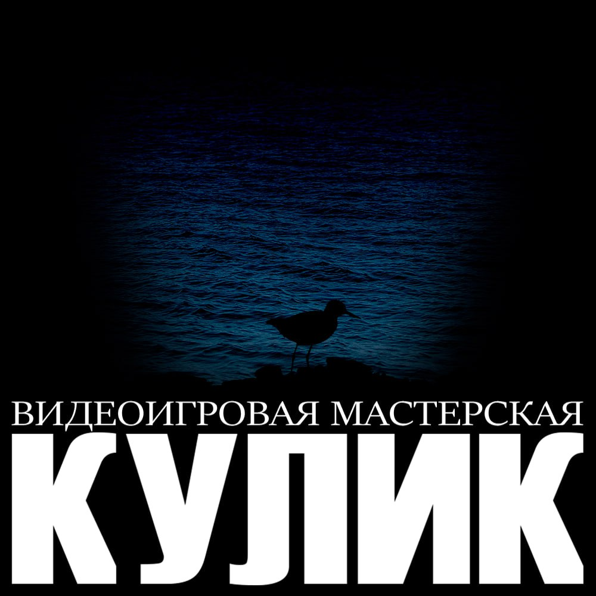

## Current bugs
- Pieces hover works in unconvinient ways

## Features
#### Added in this commit
- Now when you press on a piece the code uses piece position and not the mouse position
- A bit better visualisation of allowed moves(now irrelevant to move pieces are half tranfparent)
- Z-Index is better but still wrong
- Pieces cant move against rules
- COMMENTS!!!

#### Already existing
- Visualisation of allowed moves
- Board is centered
- Eased snapping
- Pieces snapping to tiles
- Movable pieces
- Dynamic board