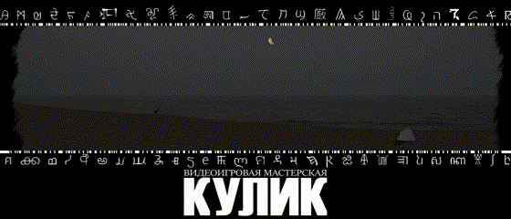

## Current bugs
- Pieces hover works in unconvinient ways
- No way to win for both sides
- Death of the king does nothing
- If window isnt 16:9 then view makes no sense

## Features
#### Added in this commit
- Board size is linked to width of window

#### Already existing
- Logic to take pieces
- Part of the new ui
- An animation of pieces
- File names and variables are easily readable
- Implemented sides 
- Added comments
- Z-Index is fixed
- Pieces cant move against rules
- Visualisation of allowed moves
- Board is centered
- Eased snapping
- Pieces snapping to tiles
- Movable pieces
- Dynamic board